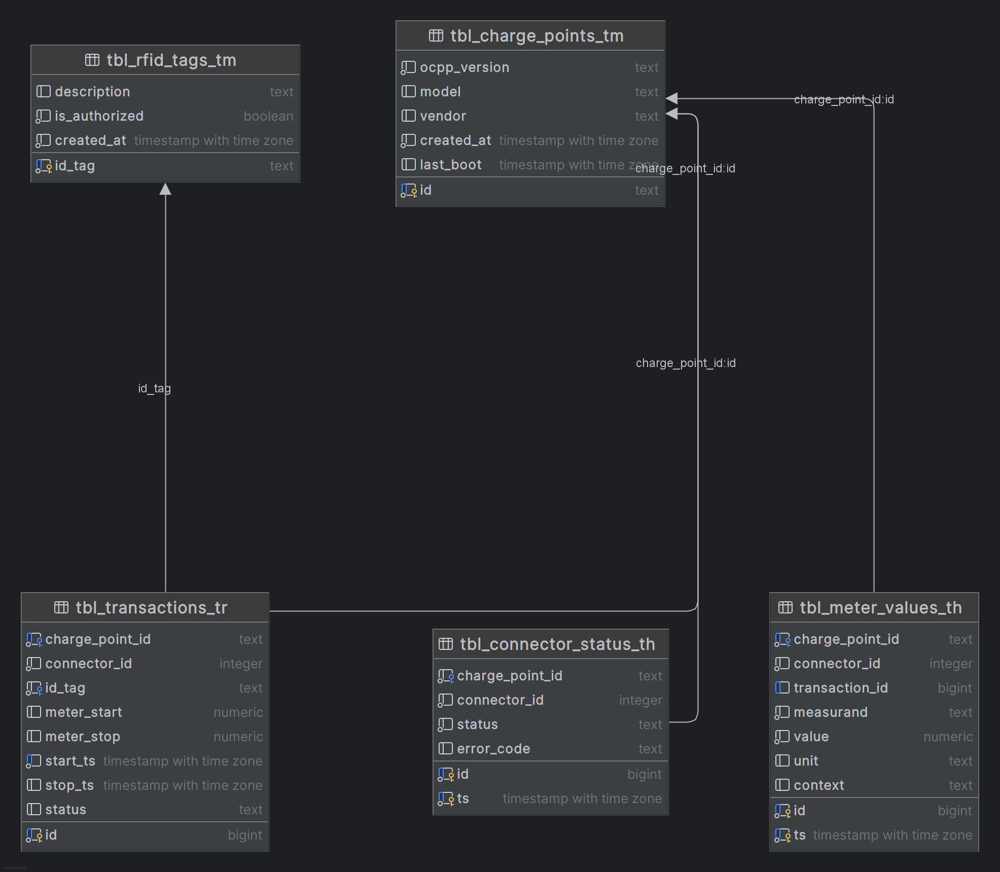
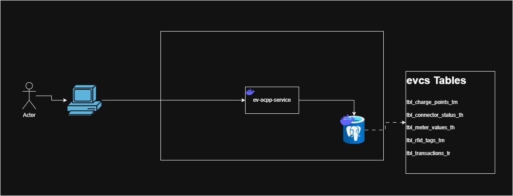

# 🚗⚡ EV OCPP Service (OCPP 1.6J)

EV OCPP Service is a backend system built with **Node.js + TypeScript** that implements the **OCPP 1.6J protocol** over WebSockets.  
It handles communication with EV charging stations (charge points), processes OCPP messages, validates payloads using **Zod**, and stores transaction data into **PostgreSQL**.

---

## 📌 Features

- Full WebSocket server for **OCPP 1.6J**
- Supports all core OCPP messages:
    - BootNotification
    - Heartbeat
    - Authorize
    - StatusNotification
    - StartTransaction
    - MeterValues
    - StopTransaction
- Schema validation using **Zod**
- PostgreSQL integration for persisting:
    - ChargePoint sessions
    - Transactions
    - Meter values
- Structured project architecture using TypeScript
- Configurable environment (port, DB, etc.)
- Property-based config support (`base.properties`, `dev.properties`, etc.)

---

## 📦 Project Information

| Item | Value |
|------|--------|
| **Project Name** | EV OCPP Service |
| **Version** | 0.1.0 <!-- update manually if needed --> |
| **Language** | Node.js + TypeScript |
| **OCPP Version** | 1.6J |
| **Database** | PostgreSQL |
| **Protocol** | WebSocket (ws://) |

---

## 🛠 Tech Stack & Dependencies

### **Core Dependencies**
- `ws` – WebSocket server
- `zod` – Runtime validation for OCPP payloads
- `pg` – PostgreSQL client
- `dotenv` (optional) – environment variable loader
---

## Database schema:

# high level system diagram
